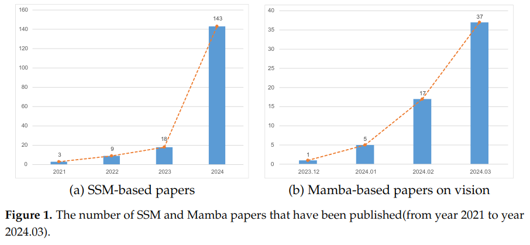

<div align="center">
<h1> A Survey on Visual Mamba </h1>

[](https://arxiv.org/abs/2404.15956)
[](https://GitHub.com/Naereen/StrapDown.js/graphs/commit-activity)
[](http://makeapullrequest.com) 
[](https://github.com/sindresorhus/awesome)


</div>


Authors: [Hanwei Zhang](https://hanwei0912.github.io/), Ying Zhu, Dan Wang, [Lijun Zhang](https://scholar.google.com/citations?user=swBYV0YAAAAJ&hl=en&oi=sra), [Tianxiang Chen](https://scholar.google.com/citations?user=xU3Ysg0AAAAJ&hl=en&oi=sra), [Ziyang Wang](https://github.com/ziyangwang007) and [Zi Ye](https://scholar.google.com/citations?user=1V0CqfYAAAAJ&hl=zh-CN). 
</p>





<hr />

A curated list of awesome Mamba for Computer Vision (**in chronological order**), inspired by the other awesome-initiatives. We intend to regularly update the relevant latest papers and their open-source implementations on this page. 

We strongly encourage the researchers that want to promote their fantastic work to the community to make pull request to update their paper's information!


## Citation

If you find the listing and survey useful for your work, please cite the paper:

- Zhang, Hanwei, et al. "A Survey on Visual Mamba." arXiv preprint arXiv:2404.15956 (2024).

```bibtex
@article{zhang2024survey,
  title={A Survey on Visual Mamba},
  author={Zhang, Hanwei and Zhu, Ying and Wang, Dan and Zhang, Lijun and Chen, Tianxiang and Wang, Ziyang and Ye, Zi},
  journal={arXiv preprint arXiv:2404.15956},
  year={2024}
}
```


## Overview
- [Survey Papers](#Survey-Papers)
- [Mamba Backbone](#Mamba-Backbone)
- [Image Classification](#Image-Classification)
- [Object Detection](#Object-Detection)
- [Image Segmentation](#Image-Segmentation)
- [Video Classification](#Video-Classification)
- [Video Understanding](#Video-Understanding)
- [Multi-Modal Understanding](#Multi-Modal-Understanding)
- [Video Prediction](#Video-Prediction)
- [Image Registration](#Image-Registration)
- [Image Super-Resolution](#Image-Super-Resolution)
- [Image Restoration](#Image-Restoration)
- [Image Dehazing](#Image-Dehazing)
- [Image Derain](#Image-Derain)
- [Image Deblurring](#Image-Deblurring)
- [Visual Generation](#Visual-Generation)
- [Point Cloud](#Point-Cloud)
- [3D Reconstruction](#3D-Reconstruction)
- [Video Generation](#Video-Generation)
- [Others](#Others)


# Survey Papers
**A Survey on Visual Mamba.** [24th April., 2024].<br>
*Zhang, Hanwei, Ying Zhu, Dan Wang, Lijun Zhang, Tianxiang Chen, Ziyang Wang, and Zi Ye.*<br>
 [[PDF](https://arxiv.org/abs/2404.15956)] 
 
**A survey on vision mamba: Models, applications and challenges.** [29th April., 2024].<br>
*Xu, Rui, Shu Yang, Yihui Wang, Bo Du, and Hao Chen.*<br>
 [[PDF](https://arxiv.org/pdf/2404.18861)] 

**Vision Mamba: A Comprehensive Survey and Taxonomy** [7th May., 2024].<br>
*Liu, Xiao, Chenxu Zhang, and Lei Zhang.*<br>
 [[PDF](https://arxiv.org/pdf/2405.04404)] 

**Rethinking Scanning Strategies with Vision Mamba in Semantic Segmentation of Remote Sensing Imagery: An Experimental Study.** [14th May., 2024].<br>
*Zhu, Qinfeng, Yuan Fang, Yuanzhi Cai, Cheng Chen, and Lei Fan.*<br>
 [[PDF](https://arxiv.org/pdf/2405.08493)] 

**Mamba-360: Survey of state space models as transformer alternative for long sequence modelling: Methods, applications, and challenges.** [24th April., 2024].<br>
*Patro, Badri Narayana, and Vijay Srinivas Agneeswaran.*<br>
 [[PDF](https://arxiv.org/abs/2404.16112)] 

# Mamba Backbone

**Vision mamba: Efficient visual representation learning with bidirectional state space mode.** [17th Jan., 2024].<br>
*Zhu, Lianghui, Bencheng Liao, Qian Zhang, Xinlong Wang, Wenyu Liu, and Xinggang Wang.*<br>
 [[PDF](https://arxiv.org/pdf/2401.09417)] 

**Vmamba: Visual state space model.** [18th Jan., 2024].<br>
*Liu, Yue, Yunjie Tian, Yuzhong Zhao, Hongtian Yu, Lingxi Xie, Yaowei Wang, Qixiang Ye, and Yunfan Liu.*<br>
 [[PDF](https://arxiv.org/abs/2401.10166)] 

**Plainmamba: Improving non-hierarchical mamba in visual recognition.** [26th Mar., 2024].<br>
*Chenhongyi Yang, Zehui Chen, Miguel Espinosa, Linus Ericsson, Zhenyu Wang, Jiaming Liu, Elliot J. Crowley.*<br>
 [[PDF](https://arxiv.org/abs/2403.17695)] 

**Localmamba: Visual state space model with windowed selective scan.** [14th Mar., 2024].<br>
*Tao Huang, Xiaohuan Pei, Shan You, Fei Wang, Chen Qian, Chang Xu.*<br>
 [[PDF](https://arxiv.org/abs/2403.09338)] 

**Mamba-ND: Selective State Space Modeling for Multi-Dimensional Data.** [8th Feb., 2024].<br>
*Shufan Li, Harkanwar Singh, Aditya Grover.*<br>
 [[PDF](https://arxiv.org/abs/2402.05892)] 

**SiMBA: Simplified Mamba-Based Architecture for Vision and Multivariate Time series.** [22th Mar., 2024].<br>
*Badri N. Patro, Vijay S. Agneeswaran.*<br>
 [[PDF](https://arxiv.org/abs/2403.15360)] 

# Image Classification 

**Res-VMamba: Fine-Grained Food Category Visual Classification Using Selective State Space Models with Deep Residual Learning.** [24th Feb., 2024].<br>
*Chen, Chi-Sheng, Guan-Ying Chen, Dong Zhou, Di Jiang, and Dai-Shi Chen.*<br>
 [[PDF](https://arxiv.org/abs/2402.15761)] 

**Medmamba: Vision mamba for medical image classification.** [6th Mar., 2024].<br>
*Yue, Yubiao, and Zhenzhang Li.*<br>
 [[PDF](https://arxiv.org/abs/2403.03849)] 

# Object Detection

**State Space Models for Event Cameras.** [23th Feb., 2024].<br>
*Nikola Zubić, Mathias Gehrig, Davide Scaramuzza.*<br>
 [[PDF](https://arxiv.org/abs/2402.15584)] 

**MiM-ISTD: Mamba-in-Mamba for Efficient Infrared Small Target Detection.** [3rd Apr., 2024].<br>
*Tianxiang Chen, Zhentao Tan, Tao Gong, Qi Chu, Yue Wu, Bin Liu, Jieping Ye, Nenghai Yu.*<br>
 [[PDF](https://arxiv.org/abs/2403.02148)] 


# Image Segmentation

**ReMamber: Referring Image Segmentation with Mamba Twister.** [26th Mar., 2024].<br>
*Yuhuan Yang, Chaofan Ma, Jiangchao Yao, Zhun Zhong, Ya Zhang, Yanfeng Wang.*<br>
 [[PDF](https://arxiv.org/abs/2403.17839)] 

**Mamba-UNet: UNet-Like Pure Visual Mamba for Medical Image Segmentation.** [7th Feb., 2024].<br>
*Ziyang Wang, Jian-Qing Zheng, Yichi Zhang, Ge Cui, Lei Li.*<br>
 [[PDF](https://arxiv.org/abs/2402.05079)] 

**Sigma: Siamese Mamba Network for Multi-Modal Semantic Segmentation.** [5th Apr., 2024].<br>
*Zifu Wan, Yuhao Wang, Silong Yong, Pingping Zhang, Simon Stepputtis, Katia Sycara, Yaqi Xie.*<br>
 [[PDF](https://arxiv.org/abs/2404.04256)] 

# Video Classification

**Long Movie Clip Classification with State-Space Video Models.** [14th Nov., 2022].<br>
*Islam, Md Mohaiminul, and Gedas Bertasius.*<br>
 [[PDF](https://link.springer.com/chapter/10.1007/978-3-031-19833-5_6)] 

# Video Understanding

**VideoMamba: State Space Model for Efficient Video Understanding.** [11th Mar., 2024].<br>
*Kunchang Li, Xinhao Li, Yi Wang, Yinan He, Yali Wang, Limin Wang, Yu Qiao.*<br>
 [[PDF](https://arxiv.org/abs/2403.06977)] 

**SpikeMba: Multi-Modal Spiking Saliency Mamba for Temporal Video Grounding.** [1st Apr., 2024].<br>
*Wenrui Li, Xiaopeng Hong, Xiaopeng Fan.*<br>
 [[PDF](https://arxiv.org/abs/2404.01174)] 

**Video Mamba Suite: State Space Model as a Versatile Alternative for Video Understanding.** [14th Mar., 2024].<br>
*Guo Chen, Yifei Huang, Jilan Xu, Baoqi Pei, Zhe Chen, Zhiqi Li, Jiahao Wang, Kunchang Li, Tong Lu, Limin Wang.*<br>
 [[PDF](https://arxiv.org/abs/2403.09626)] 


# Image Registration

**MambaMorph: a Mamba-based Framework for Medical MR-CT Deformable Registration.** [25th Jan., 2024].<br>
*Tao Guo, Yinuo Wang, Shihao Shu, Diansheng Chen, Zhouping Tang, Cai Meng, Xiangzhi Bai.*<br>
 [[PDF](https://arxiv.org/abs/2401.13934)] [[Github](https://github.com/Guo-Stone/MambaMorph)]

**VMambaMorph: a Multi-Modality Deformable Image Registration Framework based on Visual State Space Model with Cross-Scan Module.** [7th Apr., 2024].<br>
*Ziyang Wang, Jian-Qing Zheng, Chao Ma, Tao Guo.*<br>
 [[PDF](https://arxiv.org/abs/2404.05105)] 


# Multi-Modal Understanding

**Cobra: Extending Mamba to Multi-Modal Large Language Model for Efficient Inference.** [21th Mar., 2024].<br>
*Han Zhao, Min Zhang, Wei Zhao, Pengxiang Ding, Siteng Huang, Donglin Wang.*<br>
 [[PDF](https://arxiv.org/abs/2403.14520)] 


# Video Prediction

**VMRNN: Integrating Vision Mamba and LSTM for Efficient and Accurate Spatiotemporal Forecasting.** [25th Mar., 2024].<br>
*Yujin Tang, Peijie Dong, Zhenheng Tang, Xiaowen Chu, Junwei Liang.*<br>
 [[PDF](https://arxiv.org/abs/2403.16536)] 


# Image Super-Resolution

**Activating Wider Areas in Image Super-Resolution.** [13th Mar., 2024].<br>
*Cheng Cheng, Hang Wang, Hongbin Sun.*<br>
 [[PDF](https://arxiv.org/abs/2403.08330)] 

# Image Restoration

**MambaIR: A Simple Baseline for Image Restoration with State-Space Model.** [23th Feb., 2024].<br>
*Hang Guo, Jinmin Li, Tao Dai, Zhihao Ouyang, Xudong Ren, Shu-Tao Xia.*<br>
 [[PDF](https://arxiv.org/abs/2402.15648)] 

**Serpent: Scalable and Efficient Image Restoration via Multi-scale Structured State Space Models.** [26th Mar., 2024].<br>
*Mohammad Shahab Sepehri, Zalan Fabian, Mahdi Soltanolkotabi.*<br>
 [[PDF](https://arxiv.org/abs/2403.17902)] 

# Image Dehazing

**U-shaped Vision Mamba for Single Image Dehazing.** [6th Feb., 2024].<br>
*Zhuoran Zheng, Chen Wu.*<br>
 [[PDF](https://arxiv.org/abs/2402.04139)] 

# Image Derain

**FreqMamba: Viewing Mamba from a Frequency Perspective for Image Deraining.** [15th Apr., 2024].<br>
*Zou Zhen, Yu Hu, Zhao Feng.*<br>
 [[PDF](https://arxiv.org/abs/2403.20106)] 

# Image Deblurring

**Learning Enriched Features via Selective State Spaces Model for Efficient Image Deblurring.** [29th Mar., 2024].<br>
*Hu Gao, Depeng Dang.*<br>
 [[PDF](https://arxiv.org/abs/2402.09476)] 

# Visual generation

**MambaTalk: Efficient Holistic Gesture Synthesis with Selective State Space Models.** [14th Mar., 2024].<br>
*Zunnan Xu, Yukang Lin, Haonan Han, Sicheng Yang, Ronghui Li, Yachao Zhang, Xiu Li.*<br>
 [[PDF](https://arxiv.org/abs/2403.09471)] 

**Scalable Diffusion Models with State Space Backbone.** [8th Feb., 2024].<br>
*Zhengcong Fei, Mingyuan Fan, Changqian Yu, Junshi Huang.*<br>
 [[PDF](https://arxiv.org/abs/2402.05608)] 


**ZigMa: A DiT-style Zigzag Mamba Diffusion Model.** [20th Mar., 2024].<br>
*Vincent Tao Hu, Stefan Andreas Baumann, Ming Gui, Olga Grebenkova, Pingchuan Ma, Johannes Fischer, Björn Ommer.*<br>
 [[PDF](https://arxiv.org/abs/2403.13802)] 

**Motion Mamba: Efficient and Long Sequence Motion Generation with Hierarchical and Bidirectional Selective SSM.** [12th Mar., 2024].<br>
*Zeyu Zhang, Akide Liu, Ian Reid, Richard Hartley, Bohan Zhuang, Hao Tang.*<br>
 [[PDF](https://arxiv.org/abs/2403.07487)] 

# Point cloud

**Point Mamba: A Novel Point Cloud Backbone Based on State Space Model with Octree-Based Ordering Strategy.** [11th Mar., 2024].<br>
*Jiuming Liu, Ruiji Yu, Yian Wang, Yu Zheng, Tianchen Deng, Weicai Ye, Hesheng Wang.*<br>
 [[PDF](https://arxiv.org/abs/2403.06467)] 

**3DMambaComplete: Exploring Structured State Space Model for Point Cloud Completion.** [10th Apr., 2024].<br>
*Yixuan Li, Weidong Yang, Ben Fei.*<br>
 [[PDF](https://arxiv.org/abs/2404.07106)] 

**3DMambaIPF: A State Space Model for Iterative Point Cloud Filtering via Differentiable Rendering.** [8th Apr., 2024].<br>
*Qingyuan Zhou, Weidong Yang, Ben Fei, Jingyi Xu, Rui Zhang, Keyi Liu, Yeqi Luo, Ying He.*<br>
 [[PDF](https://arxiv.org/abs/2404.05522)] 

**Point Cloud Mamba: Point Cloud Learning via State Space Model.** [1th Mar., 2024].<br>
*Tao Zhang, Xiangtai Li, Haobo Yuan, Shunping Ji, Shuicheng Yan.*<br>
 [[PDF](https://arxiv.org/abs/2403.00762)] 


# 3D Reconstruction

**Gamba: Marry Gaussian Splatting with Mamba for single view 3D reconstruction.** [27th Mar., 2024].<br>
*Qiuhong Shen, Xuanyu Yi, Zike Wu, Pan Zhou, Hanwang Zhang, Shuicheng Yan, Xinchao Wang.*<br>
 [[PDF](https://arxiv.org/abs/2403.18795)] 

# Video Generation

**SSM Meets Video Diffusion Models: Efficient Video Generation with Structured State Spaces.** [12th Mar., 2024].<br>
*Yuta Oshima, Shohei Taniguchi, Masahiro Suzuki, Yutaka Matsuo.*<br>
 [[PDF](https://arxiv.org/abs/2403.07711)] 

# Others


